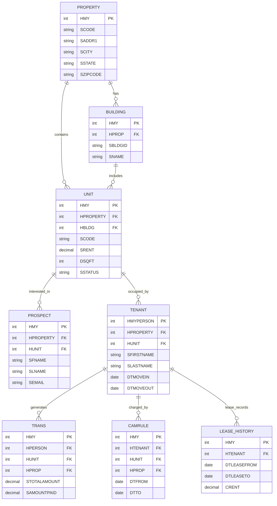

# Chatbottest

```mermaid
erDiagram

PROPERTY {
  int HMY PK
  string SCODE
  string SADDR1
  string SCITY
  string SSTATE
  string SZIPCODE
}

BUILDING {
  int HMY PK
  int HPROP FK
  string SBLDGID
  string SNAME
}

UNIT {
  int HMY PK
  int HPROPERTY FK
  int HBLDG FK
  string SCODE
  decimal SRENT
  int DSQFT
  string SSTATUS
}

PROSPECT {
  int HMY PK
  int HPROPERTY FK
  int HUNIT FK
  string SFNAME
  string SLNAME
  string SEMAIL
}

TENANT {
  int HMYPERSON PK
  int HPROPERTY FK
  int HUNIT FK
  string SFIRSTNAME
  string SLASTNAME
  date DTMOVEIN
  date DTMOVEOUT
}

TRANS {
  int HMY PK
  int HPERSON FK
  int HUNIT FK
  int HPROP FK
  decimal STOTALAMOUNT
  decimal SAMOUNTPAID
}

CAMRULE {
  int HMY PK
  int HTENANT FK
  int HUNIT FK
  int HPROP FK
  date DTFROM
  date DTTO
}

LEASE_HISTORY {
  int HMY PK
  int HTENANT FK
  date DTLEASEFROM
  date DTLEASETO
  decimal CRENT
}

PROPERTY ||--o{ BUILDING : has
PROPERTY ||--o{ UNIT : contains
BUILDING ||--o{ UNIT : includes
UNIT ||--o{ PROSPECT : interested_in
UNIT ||--o{ TENANT : occupied_by
TENANT ||--o{ TRANS : generates
TENANT ||--o{ CAMRULE : charged_by
TENANT ||--o{ LEASE_HISTORY : lease_records
```
